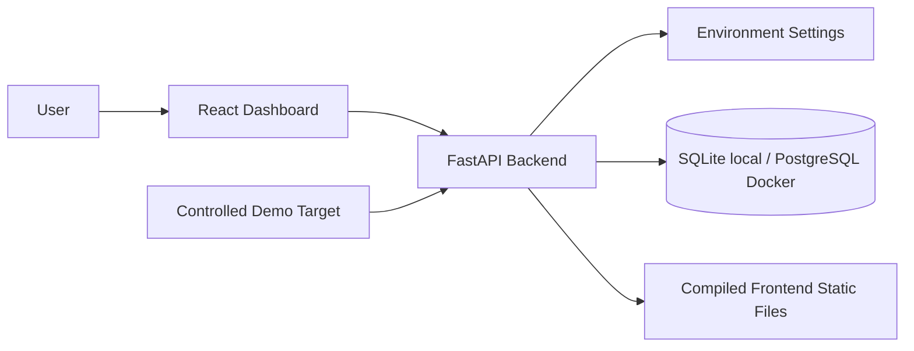

# SentinelSight AI Architecture

## Milestone 1 Foundation

## Backend

The backend is a FastAPI application with clear package boundaries for API routes, core
configuration, models, repositories, services, scanners, security modules and utilities. Milestone 2
adds `/api/auth/*` and `/api/users/*`, backed by Argon2 password hashing, signed cookie tokens and
role dependencies. Milestone 3 adds `/api/websites/*` for organization-scoped website asset
registration and management.

## Frontend

The frontend is a Vite React TypeScript application. Milestone 1 provides the application shell and health status page without claiming unfinished scanner features.

## Database

The app uses SQLAlchemy configuration that supports SQLite for local development and PostgreSQL in
Docker or production. Current tables include `organizations` and `users`; later milestones will add
website assets. Later milestones will add scans, baselines, findings, incidents, audit logs and AI
analysis records.

## Security Boundaries

Security-critical code is kept in dedicated modules. Authentication and organization-scoped user
management are implemented. Future milestones will add SSRF validation, passive scan controls,
baseline comparison, incident workflow and audit-chain verification.

Website registration has a lightweight URL normalization boundary. The stronger SSRF boundary lives
in the scanner milestone because it must validate DNS resolution, redirects and browser requests
immediately before outbound network access.
