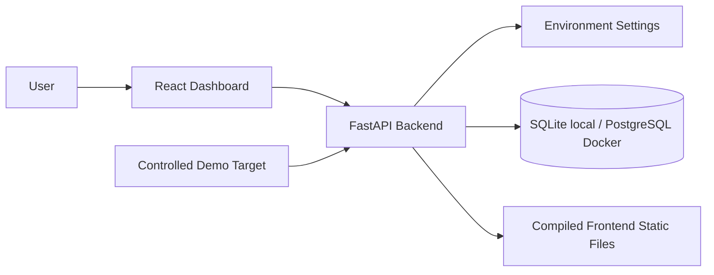

# SentinelSight AI Architecture

## Milestone 1 Foundation

## Backend

The backend is a FastAPI application with clear package boundaries for API routes, core
configuration, models, repositories, services, scanners, security modules and utilities. Milestone 2
adds `/api/auth/*` and `/api/users/*`, backed by Argon2 password hashing, signed cookie tokens and
role dependencies. Milestone 3 adds `/api/websites/*` for organization-scoped website asset
registration and management. Milestones 4 and 5 add `/api/*/scans`, findings, screenshot evidence
and baseline approval routes. Milestones 6 and 7 add comparison, calculated risk, incidents and
audit verification routes. Milestone 8 adds organization-scoped BYOK AI configuration and
scan/incident AI analysis endpoints.

Scanner modules are split by responsibility:

- `url_validator.py` wraps the scanner-grade URL safety boundary.
- `http_scanner.py` performs bounded HTTP fetching and redirect revalidation.
- `content_analyzer.py` extracts page title, bounded visible text, hashes and external domains.
- `header_analyzer.py` generates deterministic passive HTTP/header/cookie findings.
- `tls_analyzer.py` checks HTTPS certificate expiry passively.
- `screenshot_capture.py` captures Playwright screenshots with request interception.
- `visual_comparison.py` generates screenshot pHash distance, changed-pixel percentage and
  highlighted difference images.
- `comparison_analyzer.py` compares titles, bounded visible text and external domains against the
  active baseline.
- `risk_engine.py` turns deterministic evidence into an explainable score and level.
- `scan_orchestrator.py` coordinates persistence and failure handling.

AI provider code is isolated under `backend/app/services/ai/`:

- `encryption.py` encrypts provider API keys using key material derived from `APP_SECRET_KEY`.
- `provider_factory.py` selects Gemini, OpenAI or OpenAI-compatible providers.
- `service.py` builds bounded structured evidence and records AI analysis results.
- Deterministic scanner output remains separate from AI Incident Analysis.

## Frontend

The frontend is a Vite React TypeScript application. It includes authenticated website management,
role-aware scan starting, scan-status polling, scan history, baseline approval, comparison scan
details, incident response pages, audit-chain verification and Administrator AI Configuration. It
never renders raw target HTML and never stores API keys in browser storage.

## Database

The app uses SQLAlchemy configuration that supports SQLite for local development and PostgreSQL in
Docker or production. Current tables include `organizations`, `users`, `website_assets`, `scans`,
`findings`, `baselines`, `incidents`, `incident_notes`, `audit_logs`, `ai_configurations`,
`ai_analyses` and legacy `audit_entries`. The `audit_logs` table stores a per-organization hash
chain with a defined genesis hash.

## Security Boundaries

Security-critical code is kept in dedicated modules. Authentication, organization-scoped user
management, SSRF validation, passive scan controls, screenshot/difference evidence authorization,
incident RBAC, audit-chain verification and encrypted BYOK AI configuration are implemented.

Website registration has a lightweight URL normalization boundary. The stronger SSRF boundary runs
immediately before outbound HTTP and Playwright network access, including redirects and browser
subresources. The only internal exception is the exact development/test `http://demo-target:9000`
Compose service, disabled by default outside Compose and rejected in production.
