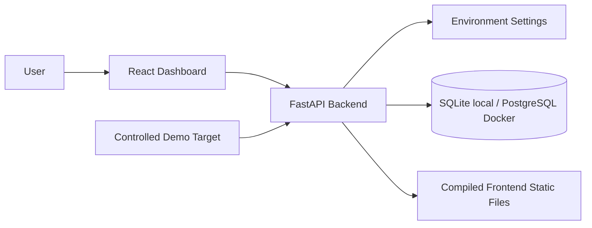

# SentinelSight AI Architecture

## Milestone 1 Foundation

## Backend

The backend is a FastAPI application with clear package boundaries for API routes, core
configuration, models, repositories, services, scanners, security modules and utilities. Milestone 2
adds `/api/auth/*` and `/api/users/*`, backed by Argon2 password hashing, signed cookie tokens and
role dependencies. Milestone 3 adds `/api/websites/*` for organization-scoped website asset
registration and management. Milestones 4 and 5 add `/api/*/scans`, findings, screenshot evidence
and baseline approval routes.

Scanner modules are split by responsibility:

- `url_validator.py` wraps the scanner-grade URL safety boundary.
- `http_scanner.py` performs bounded HTTP fetching and redirect revalidation.
- `content_analyzer.py` extracts page title, bounded visible text, hashes and external domains.
- `header_analyzer.py` generates deterministic passive HTTP/header/cookie findings.
- `tls_analyzer.py` checks HTTPS certificate expiry passively.
- `screenshot_capture.py` captures Playwright screenshots with request interception.
- `scan_orchestrator.py` coordinates persistence and failure handling.

## Frontend

The frontend is a Vite React TypeScript application. It includes authenticated website management,
role-aware scan starting, scan-status polling, scan history, baseline approval and a scan detail
view for screenshot and passive finding review.

## Database

The app uses SQLAlchemy configuration that supports SQLite for local development and PostgreSQL in
Docker or production. Current tables include `organizations`, `users`, `website_assets`, `scans`,
`findings`, `baselines` and simple `audit_entries` for baseline approval. Later milestones will add
incidents, tamper-evident audit-chain fields and AI analysis records only when that scope is
implemented.

## Security Boundaries

Security-critical code is kept in dedicated modules. Authentication, organization-scoped user
management, SSRF validation, passive scan controls and screenshot evidence authorization are
implemented. Future milestones will add visual baseline comparison, incident workflow and
audit-chain verification.

Website registration has a lightweight URL normalization boundary. The stronger SSRF boundary runs
immediately before outbound HTTP and Playwright network access, including redirects and browser
subresources. The only internal exception is the exact development/test `http://demo-target:9000`
Compose service, disabled by default outside Compose and rejected in production.
